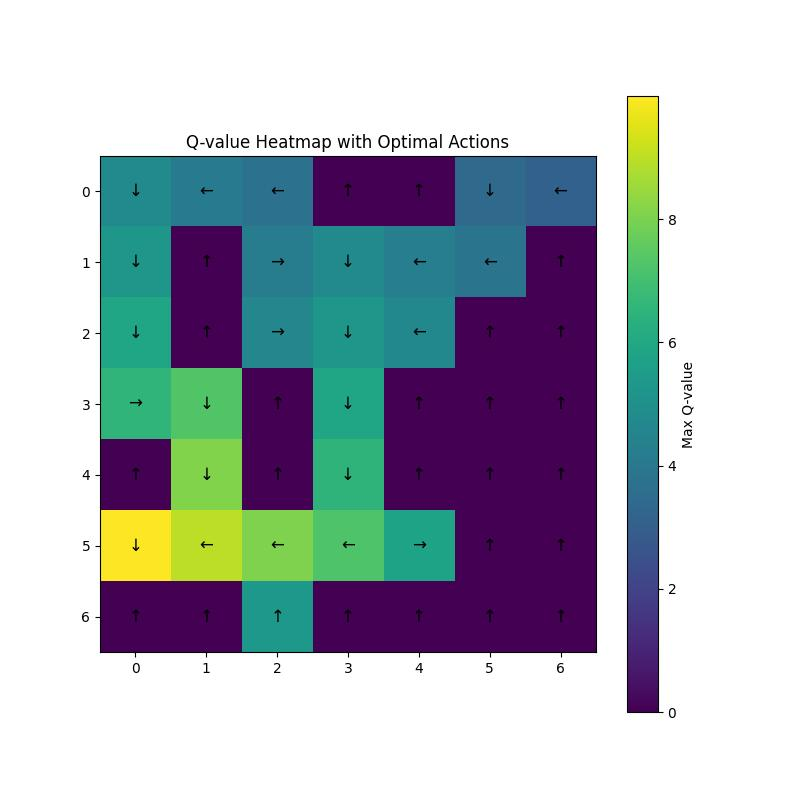

# Project 3: Reinforcement learning

## Context

Once again, you will find below a quick introduction to the subject of this project. It is not exhaustive at all. My best advice is to read my report where I explain the subject and I analyse with precision the computed results.

### Value Iteration

The agent computes the optimal state values for every state in a Markov decision problem using the following formula:

${V_{k+1}^*(s) = \max_a \sum_{s'} T(s, a, s') (R(s, a, s') + \gamma V_k^*(s')}$

The agent knows the environment, it knows the transition probabilities. It works by iteratively updating the value of each state based on the expected rewards from possible actions until the values converge. Here is a look at the final resulting heatmap after the values have converged:


### Q-learning

In this case, the agent doesn't know about the environment. It is called _offline_ learning. The actions can not therefore be taken optimally. Different policies exist to choose an action from a state. Two were used in this project:

- $\epsilon$-greedy
- softmax

In short, the agent can take the optimal action based on what was already computed which leads to "exploitation" or it can take a random action which leads to "exploration".

Here is an example using the $\epsilon$-greedy policy:



### General use cases

- **Reinforcement Learning (Decision Making under Uncertainty)**  
  Learns optimal behavior through interaction with an environment. Value Iteration and Q-learning maximize long-term rewards.

- **Robotics Control**  
  Robots learn navigation or control policies from experience. Q-learning adapts actions based on sensor feedback.

- **Game Playing**  
  Agents learn strategies by trial and error. Common in video games and simulated environments.

- **Autonomous Driving (Subtasks)**  
  Applied to lane keeping, speed control, or traffic light handling. Training is usually done in simulation.

- **Resource Management**  
  Optimizes decisions over time with limited resources. Used in data centers and network routing.

- **Finance and Trading**  
  Learns trading policies based on rewards like profit or risk. Q-learning adapts to market dynamics.


## Run the project

At the root of this directory, run:

```bash
python3 src/main.py
```