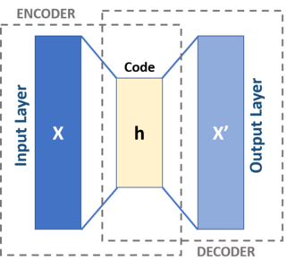

# Project 4: Neural Networks

## Context

The concept of neural network is not very specific. In fact, there are different types of neural networks used for different purposes. In this project, I implemented an _auto-encoder_ which learns efficient coding on unlabeled data. It is composed by two functions: an encoding function that transforms the input data, and a decoding function that recreates the input data from the encoded representation. The autoencoder learns an efficient representation (encoding) for a set of data, typically for dimensionality reduction, to generate lower-dimensional embeddings for subsequent use by other machine learning algorithms. ([Wikipedia](https://en.wikipedia.org/wiki/Autoencoder))



The interesting part of this project lies within the analysis of different parameters such as the number of _epochs_, the batch size and the value of the learning rate. It is also very relevant in today's context with all the LLMs.

## General and other use cases

- **Computer Vision**  
  Neural networks analyze images and videos. Used in face recognition, medical imaging, and autonomous vehicles.

- **Natural Language Processing (NLP)**  
  Neural networks understand and generate text. Used in translation, chatbots, and search engines.

- **Speech Recognition**  
  Neural networks convert speech to text. Used in voice assistants and transcription systems.

- **Recommendation Systems**  
  Neural networks predict user preferences. Used by Netflix, Spotify, and Amazon.

- **Fraud Detection**  
  Neural networks detect anomalous transactions. Used in banking and online payments.

- **Autonomous Driving**  
  Neural networks process sensor data for perception and control. Used in self-driving cars.

- **Healthcare Diagnostics**  
  Neural networks assist in medical decision-making. Used in radiology and disease prediction.

## Run the project

First you must download the data from [Kaggle]( https://www.kaggle.com/datasets/oddrationale/mnist-in-csv) and put the downloaded files in the data directory. Once this is done, at the root of this directory, run:

```bash
python3 src/main.py
```