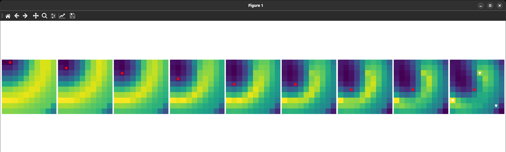

# Project 2: Bayesian Networks

## Context



### Technical implementation

This project focuses on the implementation of a Bayesian Network using a matrix filled with a a probability in each cell. The goal of the agent is to find the hidden gems based on an obervation vector and the supposed positions of the gems. We then calculate the Manhattan distance between the two vectors that we inject into the $e^{\frac{d}{\lambda}}$ formule where ${\lambda}$ is a hyperparameter that controls the sensibility to the divergence between the observations and the hypotheses. The higher the value of ${\lambda}$, the more the model is tolerant to errors and the slower the model will converge towards the solutions. 

This is a small preamble, the complete analysis can be found in the scientific report in the ```doc``` directory (in french).

With this likelihood calculated, we then proceed to the inference step where we update the beliefs of all the gem positions in the probabilistic matrix by enumeration.


### General use cases
- **Probabilistic Graphical Models**  
  Bayesian networks represent random variables and their conditional dependencies. They provide a compact way to model uncertainty.

- **Reasoning Under Uncertainty**  
  Used to compute posterior probabilities given evidence. Enables inference when information is incomplete or noisy.

- **Diagnosis and Fault Detection**  
  Models causal relationships between faults and symptoms. Supports probabilistic diagnosis.

- **Decision Support Systems**  
  Helps evaluate likely outcomes under uncertainty. Often combined with utility and decision nodes.

- **Machine Learning (Probabilistic Learning)**  
  Structure and parameters can be learned from data. Useful when domain knowledge is partial.

- **Causal Modeling**  
  Encodes cause–effect relationships explicitly. Supports causal inference and explanation.


## Run the project
At the root of this directory, run:

```bash
python3 src/main.py
```